Google Data Analytics Cyclistic Case Study
================
Umesh Patel
June 22, 2021

### How Does a Bike-Share Navigate Speedy Success?

**Introduction**

This case study is a part of the Google Data Analytics Professional
Certificate specialization offered on the Coursera MOOC platform. This
case study is on Cyclistic (fictional company), a bike-share company in
Chicago. The company has a fleet of 5,824 bicycles that are geotracked
and locked into a network of 692 stations across Chicago. The bikes can
be unlocked from one station and returned to any other station in the
system anytime.

The director of marketing believes the company’s future success depends
on maximizing the number of annual memberships. **The director has set a
clear goal: Design marketing strategies aimed at converting casual
riders into annual members.** Rather than creating a marketing campaign
that targets all-new customers, the director believes there is a good
chance to convert casual riders into members. Cyclistic has pricing
plans of **single-ride passes, full-day passes, and annual
memberships**. Customers who purchase single-ride or full-day passes are
referred to as casual riders. Customers who purchase annual memberships
are Cyclistic members. As a junior data analyst working in the marketing
analyst team, I was assigned to analyze the data and make
recommendations for the marketing campaign.

I will complete this analysis using the six phases of the data analysis
process (APPAA):

1.  ASK
2.  PREPARE
3.  PROCESS
4.  ANALYZE
5.  SHARE
6.  ACT

#### 1. ASK

**Question assigned to me**

-   How do annual members and casual riders use Cyclistic bikes
    differently?

**Deliverables**

-   Analysis on how annual members and casual riders use Cyclistic bikes
    differently
-   Provide visualizations and data to support the analysis
-   Three recommendations to convert casual riders to annual members

**Stakeholders**

-   Director of marketing
-   Cyclistic executive team

#### 2. PREPARE

I will use the last 12 months of Cyclistic’s trip data. The data is
available on a monthly .csv file. I downloaded 12 files of the data from
the following link.

[Divvy Tripdata](https://divvy-tripdata.s3.amazonaws.com/index.html)

The data has been made available by Motivate International Inc. under
[this](https://www.divvybikes.com/data-license-agreement) license.

Riders’ personal information is not included in the datasets due to
data-privacy issues. So it is impossible to know if casual riders live
in the Cyclistic service area or if they have purchased multiple single
passes. Due to this fact, I would consider this a biased dataset.

The data was generated automatically by geotrackers and no manual data
entry was involved which would make me confident in the data’s
integrity.

**ROCCC**

**Reliability:** The data came from geotrackers attached to the
bicycles.  **Original:** The data comes from the primary
source.  **Comprehensive:** The data has all the necessary info to
do the analysis. It has start / end stations, start / end dates and
start / end time. The data also specifies if a rider was a member or a
casual rider.  **Current:** The data is from the last 12 months. I
am using data from May 2020 to April 2021.  **Cited:** The data
comes from the primary source and made available by Motivate
International Inc.

**I am using the following 12 .csv data files.**

1.  202005-divvy-tripdata
2.  202006-divvy-tripdata
3.  202007-divvy-tripdata
4.  202008-divvy-tripdata
5.  202009-divvy-tripdata
6.  202010-divvy-tripdata
7.  202011-divvy-tripdata
8.  202012-divvy-tripdata
9.  202101-divvy-tripdata
10. 202102-divvy-tripdata
11. 202103-divvy-tripdata
12. 202104-divvy-tripdata

**Loading the necessary libraries**

-   tidyverse
-   lubridate
-   ggplot2
-   janitor
-   skimr

**Loading the necessary data files**

There are 12 .csv data files for the last 12 months (May 2020 \~ April
2021).

**Dataframe: tripdata\_202005**

    ## # A tibble: 6 x 13
    ##   ride_id rideable_type started_at          ended_at            start_station_n~
    ##   <chr>   <chr>         <dttm>              <dttm>              <chr>           
    ## 1 02668A~ docked_bike   2020-05-27 10:03:52 2020-05-27 10:16:49 Franklin St & J~
    ## 2 7A50CC~ docked_bike   2020-05-25 10:47:11 2020-05-25 11:05:40 Clark St & Wrig~
    ## 3 2FFCDF~ docked_bike   2020-05-02 14:11:03 2020-05-02 15:48:21 Kedzie Ave & Mi~
    ## 4 58991C~ docked_bike   2020-05-02 16:25:36 2020-05-02 16:39:28 Clarendon Ave &~
    ## 5 A79651~ docked_bike   2020-05-29 12:49:54 2020-05-29 13:27:11 Hermitage Ave &~
    ## 6 1466C5~ docked_bike   2020-05-29 13:27:24 2020-05-29 14:14:45 Halsted St & Ar~
    ## # ... with 8 more variables: start_station_id <dbl>, end_station_name <chr>,
    ## #   end_station_id <dbl>, start_lat <dbl>, start_lng <dbl>, end_lat <dbl>,
    ## #   end_lng <dbl>, member_casual <chr>

#### 3. PROCESS

In this phase, I am processing the data and making it ready for the
Analysis phase.

**Verify data integrity**

I am checking here all 12 data frames to make sure they all have the
same column names, same number of columns, and the same data types.

-   colnames(tripdata\_202005) == colnames(tripdata\_202006)
-   colnames(tripdata\_202007) == colnames(tripdata\_202008)
-   colnames(tripdata\_202009) == colnames(tripdata\_202010)
-   colnames(tripdata\_202011) == colnames(tripdata\_202012)
-   colnames(tripdata\_202101) == colnames(tripdata\_202102)
-   colnames(tripdata\_202103) == colnames(tripdata\_202104)

**Check data structures and data types of all 12 data frames**

-   str(tripdata\_202005)
-   str(tripdata\_202006)
-   str(tripdata\_202007)
-   str(tripdata\_202008)
-   str(tripdata\_202009)
-   str(tripdata\_202010)
-   str(tripdata\_202011)
-   str(tripdata\_202012)
-   str(tripdata\_202101)
-   str(tripdata\_202102)
-   str(tripdata\_202103)
-   str(tripdata\_202104)

I found start\_station\_id : chr instead of start\_station\_id : num for
the following datasets.

-   tripdata\_202012
-   tripdata\_202101
-   tripdata\_202102
-   tripdata\_202103
-   tripdata\_202104

I found end\_station\_id : chr instead of end\_station\_id : num for the
following datasets.

-   tripdata\_202012
-   tripdata\_202101
-   tripdata\_202102
-   tripdata\_202103
-   tripdata\_202104

These IDs are of no use because they have different formats, missing
many values, some are numbers and some are alphanumeric. To reduce the
size of the dataframes, I will filter these as well a few other columns
out. **I will keep only the following six columns in my dataframes that
I think I will be using for my analysis.**

-   rideable\_type
-   started\_at
-   ended\_at
-   start\_station\_name
-   end\_station\_name
-   member\_casual

**Twelve dataframes with six necessary columns**

1.  tripdata\_202005v1
2.  tripdata\_202006v1
3.  tripdata\_202007v1
4.  tripdata\_202008v1
5.  tripdata\_202009v1
6.  tripdata\_202010v1
7.  tripdata\_202011v1
8.  tripdata\_202012v1
9.  tripdata\_202101v1
10. tripdata\_202102v1
11. tripdata\_202103v1
12. tripdata\_202104v1

**Merge all 12 data frames into one: tripdata\_all12v1**

**Dataframe: tripdata\_all12v1**

    ## # A tibble: 6 x 6
    ##   rideable_type started_at          ended_at            start_station_name      
    ##   <chr>         <dttm>              <dttm>              <chr>                   
    ## 1 docked_bike   2020-05-27 10:03:52 2020-05-27 10:16:49 Franklin St & Jackson B~
    ## 2 docked_bike   2020-05-25 10:47:11 2020-05-25 11:05:40 Clark St & Wrightwood A~
    ## 3 docked_bike   2020-05-02 14:11:03 2020-05-02 15:48:21 Kedzie Ave & Milwaukee ~
    ## 4 docked_bike   2020-05-02 16:25:36 2020-05-02 16:39:28 Clarendon Ave & Leland ~
    ## 5 docked_bike   2020-05-29 12:49:54 2020-05-29 13:27:11 Hermitage Ave & Polk St 
    ## 6 docked_bike   2020-05-29 13:27:24 2020-05-29 14:14:45 Halsted St & Archer Ave 
    ## # ... with 2 more variables: end_station_name <chr>, member_casual <chr>

**Column names and dimension of the merged dataframe in the beginning**

    ## [1] "rideable_type"      "started_at"         "ended_at"          
    ## [4] "start_station_name" "end_station_name"   "member_casual"

    ## [1] 3742202       6

**Removing rows with some NAs using drop\_na() function of tidyr
package**

**Dimension of the merged dataframe aftter removing NAs**

    ## [1] 3509093       6

**Loss of data calculation**

-   Number of rows before applying drop\_na function: 3742202
-   Number of rows after applying drop\_na function: 3509093
-   **Reduction in rows** = (3742202 - 3509093) / 3742202 X 100 =
    **6.23%**

**Remove duplicate rows**

**Dimension of the merged dataframe aftter removing duplicate rows**

    ## [1] 3508576       6

**Loss of data calculation**

-   Number of rows before applying drop\_na function: 3742202
-   Number of rows after removing duplicate rows: 3508576
-   Actual \# of duplicate rows removed: 3509093 - 3508576 = 517
-   **% Reduction due to the duplicate rows compared to the initial \#
    of rows:** 517 / 3742202 X 100 = **0.0138%**

**Convert started\_at and ended\_at columns to datetime data type**

**Calculate each ride length in minutes and adding a new column
ride\_len to store the values of all the ride lengths.**

**Column names of the merged dataframe after adding a new column
ride\_len**

    ## [1] "rideable_type"      "started_at"         "ended_at"          
    ## [4] "start_station_name" "end_station_name"   "member_casual"     
    ## [7] "ride_len"

**Dataframe: tripdata\_all12v1**

    ## # A tibble: 6 x 7
    ##   rideable_type started_at          ended_at            start_station_name      
    ##   <chr>         <dttm>              <dttm>              <chr>                   
    ## 1 docked_bike   2020-05-27 10:03:52 2020-05-27 10:16:49 Franklin St & Jackson B~
    ## 2 docked_bike   2020-05-25 10:47:11 2020-05-25 11:05:40 Clark St & Wrightwood A~
    ## 3 docked_bike   2020-05-02 14:11:03 2020-05-02 15:48:21 Kedzie Ave & Milwaukee ~
    ## 4 docked_bike   2020-05-02 16:25:36 2020-05-02 16:39:28 Clarendon Ave & Leland ~
    ## 5 docked_bike   2020-05-29 12:49:54 2020-05-29 13:27:11 Hermitage Ave & Polk St 
    ## 6 docked_bike   2020-05-29 13:27:24 2020-05-29 14:14:45 Halsted St & Archer Ave 
    ## # ... with 3 more variables: end_station_name <chr>, member_casual <chr>,
    ## #   ride_len <dbl>

**Plotting the ride lengths**

I am ploting the ride lengths just to get a visual idea.

<!-- -->

**Remove bad data**

The above ride length (in minutes) plot shows rides that have ride
lengths less than 0 minutes and rides that have ride lengths more than
50,000 minutes. These rides are unrealistic to me. The reasons could be
instrument error, equipment failure, technical problems, stolen or
broken bikes. I am removing all the rides that are shorter than 2
minutes. Here, I am just selecting 2 minutes and someone could select 4
or 5 minutes as very short rides as well. I am also removing all the
rides that are longer than 1440 minutes (24 hours).

-   **Remove ride lengths &lt; 2 minute**
-   **Remove ride lengths &gt; 1440 minutes (&gt; 24 hrs)**

As this is my last step of cleaning the data in the *PROCESS* phase, I
am creating a new data frame that I will use onwards.

**New dataframe name: tripdata\_all12v2**

**Dataframe: tripdata\_all12v1**

    ## # A tibble: 6 x 7
    ##   rideable_type started_at          ended_at            start_station_name      
    ##   <chr>         <dttm>              <dttm>              <chr>                   
    ## 1 docked_bike   2020-05-27 10:03:52 2020-05-27 10:16:49 Franklin St & Jackson B~
    ## 2 docked_bike   2020-05-25 10:47:11 2020-05-25 11:05:40 Clark St & Wrightwood A~
    ## 3 docked_bike   2020-05-02 14:11:03 2020-05-02 15:48:21 Kedzie Ave & Milwaukee ~
    ## 4 docked_bike   2020-05-02 16:25:36 2020-05-02 16:39:28 Clarendon Ave & Leland ~
    ## 5 docked_bike   2020-05-29 12:49:54 2020-05-29 13:27:11 Hermitage Ave & Polk St 
    ## 6 docked_bike   2020-05-29 13:27:24 2020-05-29 14:14:45 Halsted St & Archer Ave 
    ## # ... with 3 more variables: end_station_name <chr>, member_casual <chr>,
    ## #   ride_len <dbl>

**Dimension of the dataframe aftter removing unrealistic trip lengths**

    ## [1] 3419654       7

**Overall loss of data calculation**

-   Initial number of rows before any cleaning of the data: 3742202
-   Final number of rows after cleaning the data: 3419654
-   Total loss of data: 3742202 - 3419654 = 322548
-   **% Loss of data from the initial data files: 322548 / 3742202 \*
    100 = 8.619%**

**Ride length plot of the cleaned data**

<!-- -->

**Separating components of date**

Here I am separating components of date and storing them into
appropriate new columns.

**Column names after separating components of date components**

    ##  [1] "rideable_type"      "started_at"         "ended_at"          
    ##  [4] "start_station_name" "end_station_name"   "member_casual"     
    ##  [7] "ride_len"           "date"               "Year"              
    ## [10] "Month"              "mo_day"             "yr_day"            
    ## [13] "wk_day"             "Hour"

**Dataframe: tripdata\_all12v2**

    ## # A tibble: 6 x 14
    ##   rideable_type started_at          ended_at            start_station_name      
    ##   <chr>         <dttm>              <dttm>              <chr>                   
    ## 1 docked_bike   2020-05-27 10:03:52 2020-05-27 10:16:49 Franklin St & Jackson B~
    ## 2 docked_bike   2020-05-25 10:47:11 2020-05-25 11:05:40 Clark St & Wrightwood A~
    ## 3 docked_bike   2020-05-02 14:11:03 2020-05-02 15:48:21 Kedzie Ave & Milwaukee ~
    ## 4 docked_bike   2020-05-02 16:25:36 2020-05-02 16:39:28 Clarendon Ave & Leland ~
    ## 5 docked_bike   2020-05-29 12:49:54 2020-05-29 13:27:11 Hermitage Ave & Polk St 
    ## 6 docked_bike   2020-05-29 13:27:24 2020-05-29 14:14:45 Halsted St & Archer Ave 
    ## # ... with 10 more variables: end_station_name <chr>, member_casual <chr>,
    ## #   ride_len <dbl>, date <date>, Year <dbl>, Month <ord>, mo_day <int>,
    ## #   yr_day <dbl>, wk_day <ord>, Hour <int>

#### 4. ANALYSIS

In this phase, I will analyze the data to find insights.

**Finding statistical information**

Finding Minimum, Maximum, Mean, Median, standard deviation values for
the member & casual riders’ ride lengths

    ## # A tibble: 2 x 6
    ##   member_casual min_ride_len max_ride_len mean_ride_len med_ride_len std_dev
    ##   <chr>                <dbl>        <dbl>         <dbl>        <dbl>   <dbl>
    ## 1 casual                   2        1440.          37.1         21.7    63.1
    ## 2 member                   2        1440.          15.7         11.8    20.3

**Hour of day analysis**

Number of rides by casual and member riders during the hours of day

    ## # A tibble: 48 x 3
    ##    member_casual  Hour number_of_ride
    ##    <chr>         <int>          <int>
    ##  1 casual            0          22661
    ##  2 casual            1          14130
    ##  3 casual            2           7515
    ##  4 casual            3           3944
    ##  5 casual            4           3240
    ##  6 casual            5           5132
    ##  7 casual            6          12588
    ##  8 casual            7          22638
    ##  9 casual            8          31224
    ## 10 casual            9          39722
    ## # ... with 38 more rows

<!-- -->

**Day of week analysis**

Comparison of mean ride length between casual and member riders during
days of week

    ## # A tibble: 14 x 3
    ##    member_casual wk_day mean_ride_len
    ##    <chr>         <ord>          <dbl>
    ##  1 casual        Mon             36.8
    ##  2 casual        Tue             34.6
    ##  3 casual        Wed             33.2
    ##  4 casual        Thu             33.4
    ##  5 casual        Fri             35.2
    ##  6 casual        Sat             39.7
    ##  7 casual        Sun             41.2
    ##  8 member        Mon             14.9
    ##  9 member        Tue             14.8
    ## 10 member        Wed             14.8
    ## 11 member        Thu             14.9
    ## 12 member        Fri             15.4
    ## 13 member        Sat             17.5
    ## 14 member        Sun             17.6

<!-- -->

Comparison of median ride length between casual and member riders during
days of week

    ## # A tibble: 14 x 3
    ##    member_casual wk_day med_ride_len
    ##    <chr>         <ord>         <dbl>
    ##  1 casual        Mon            21.4
    ##  2 casual        Tue            19.7
    ##  3 casual        Wed            19.0
    ##  4 casual        Thu            18.9
    ##  5 casual        Fri            20.1
    ##  6 casual        Sat            23.9
    ##  7 casual        Sun            25  
    ##  8 member        Mon            11.1
    ##  9 member        Tue            11.1
    ## 10 member        Wed            11.2
    ## 11 member        Thu            11.1
    ## 12 member        Fri            11.5
    ## 13 member        Sat            13.3
    ## 14 member        Sun            13.3

<!-- -->

Comparison of number of rides by casual and member riders during the
days of week

    ## # A tibble: 14 x 3
    ##    member_casual wk_day number_of_ride
    ##    <chr>         <ord>           <int>
    ##  1 casual        Mon            150434
    ##  2 casual        Tue            147734
    ##  3 casual        Wed            154084
    ##  4 casual        Thu            161342
    ##  5 casual        Fri            210025
    ##  6 casual        Sat            334816
    ##  7 casual        Sun            262061
    ##  8 member        Mon            261523
    ##  9 member        Tue            279842
    ## 10 member        Wed            296071
    ## 11 member        Thu            291443
    ## 12 member        Fri            305021
    ## 13 member        Sat            310782
    ## 14 member        Sun            254476

<!-- -->

**Month of year analysis**

Comparison of mean ride length between casual and member riders during
the months of year

    ## # A tibble: 24 x 3
    ##    member_casual Month mean_ride_len
    ##    <chr>         <ord>         <dbl>
    ##  1 casual        Jan            22.6
    ##  2 casual        Feb            31.6
    ##  3 casual        Mar            32.6
    ##  4 casual        Apr            32.6
    ##  5 casual        May            44.8
    ##  6 casual        Jun            42.7
    ##  7 casual        Jul            44.9
    ##  8 casual        Aug            38.1
    ##  9 casual        Sep            32.9
    ## 10 casual        Oct            28.4
    ## # ... with 14 more rows

<!-- -->

Comparison of median ride length between casual and member riders during
the months of year

    ## # A tibble: 24 x 3
    ##    member_casual Month med_ride_len
    ##    <chr>         <ord>        <dbl>
    ##  1 casual        Jan           12.8
    ##  2 casual        Feb           17.0
    ##  3 casual        Mar           19.7
    ##  4 casual        Apr           19.1
    ##  5 casual        May           26.8
    ##  6 casual        Jun           24.9
    ##  7 casual        Jul           25.7
    ##  8 casual        Aug           22.6
    ##  9 casual        Sep           19.8
    ## 10 casual        Oct           16.9
    ## # ... with 14 more rows

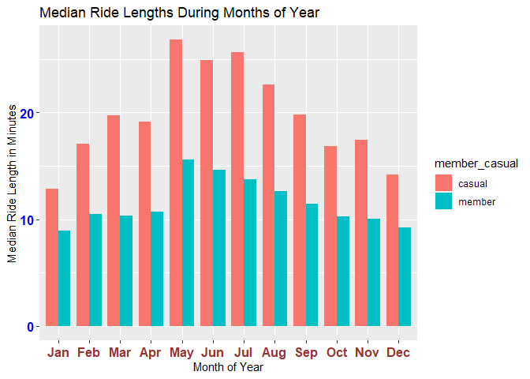<!-- -->

Comparison of number of rides between casual and member riders during
the months of year

    ## # A tibble: 24 x 3
    ##    member_casual Month number_of_ride
    ##    <chr>         <ord>          <int>
    ##  1 casual        Jan            14474
    ##  2 casual        Feb             8442
    ##  3 casual        Mar            74506
    ##  4 casual        Apr           118515
    ##  5 casual        May            85488
    ##  6 casual        Jun           152100
    ##  7 casual        Jul           264400
    ##  8 casual        Aug           276240
    ##  9 casual        Sep           210735
    ## 10 casual        Oct           119867
    ## # ... with 14 more rows

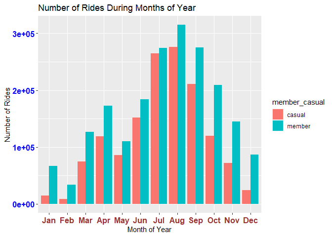<!-- -->

**Bike type analysis**

Comparison of bike type usage between casual and member riders

    ## # A tibble: 6 x 3
    ##   rideable_type member_casual number_of_rides
    ##   <chr>         <chr>                   <int>
    ## 1 classic_bike  casual                 138642
    ## 2 classic_bike  member                 381387
    ## 3 docked_bike   casual                1095719
    ## 4 docked_bike   member                1335754
    ## 5 electric_bike casual                 186135
    ## 6 electric_bike member                 282017

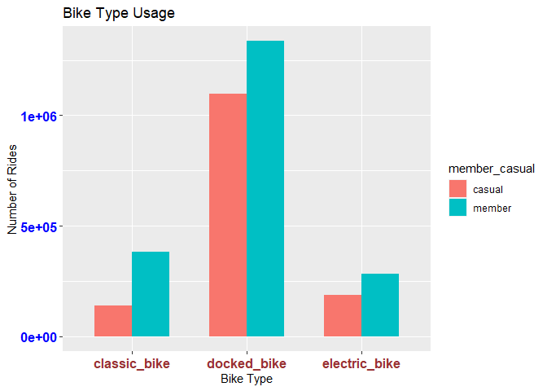<!-- -->

Comparison of docked bike usage between casual and member riders

    ## # A tibble: 14 x 3
    ##    member_casual wk_day number_of_rides
    ##    <chr>         <ord>            <int>
    ##  1 casual        Mon             112760
    ##  2 casual        Tue             107478
    ##  3 casual        Wed             118027
    ##  4 casual        Thu             125206
    ##  5 casual        Fri             162037
    ##  6 casual        Sat             264597
    ##  7 casual        Sun             205614
    ##  8 member        Mon             168788
    ##  9 member        Tue             180666
    ## 10 member        Wed             198800
    ## 11 member        Thu             196745
    ## 12 member        Fri             202499
    ## 13 member        Sat             214682
    ## 14 member        Sun             173574

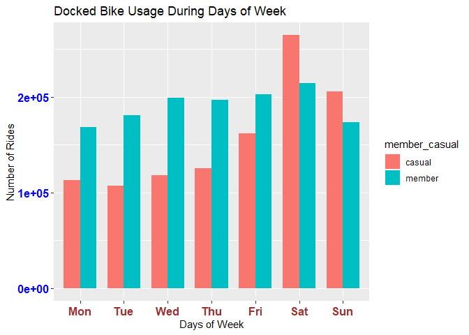<!-- -->

**Start & end stations analysis**

Most popular start stations among the casual riders

    ## # A tibble: 25 x 2
    ##    start_station_name           number_of_rides
    ##    <chr>                                  <int>
    ##  1 Streeter Dr & Grand Ave                27727
    ##  2 Lake Shore Dr & Monroe St              22911
    ##  3 Millennium Park                        20833
    ##  4 Theater on the Lake                    15811
    ##  5 Michigan Ave & Oak St                  14807
    ##  6 Indiana Ave & Roosevelt Rd             14161
    ##  7 Lake Shore Dr & North Blvd             14059
    ##  8 Michigan Ave & Lake St                 12313
    ##  9 Clark St & Elm St                      12259
    ## 10 Michigan Ave & Washington St           11274
    ## # ... with 15 more rows

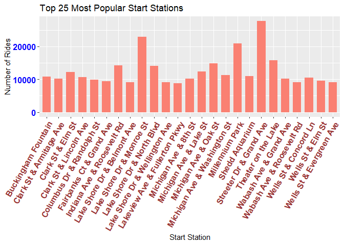<!-- -->

Most popular end stations among the casual riders

    ## # A tibble: 25 x 2
    ##    end_station_name             number_of_rides
    ##    <chr>                                  <int>
    ##  1 Streeter Dr & Grand Ave                30125
    ##  2 Lake Shore Dr & Monroe St              22291
    ##  3 Millennium Park                        21877
    ##  4 Theater on the Lake                    17858
    ##  5 Michigan Ave & Oak St                  15521
    ##  6 Lake Shore Dr & North Blvd             15106
    ##  7 Indiana Ave & Roosevelt Rd             14323
    ##  8 Michigan Ave & Lake St                 11787
    ##  9 Clark St & Elm St                      11732
    ## 10 Michigan Ave & Washington St           11281
    ## # ... with 15 more rows

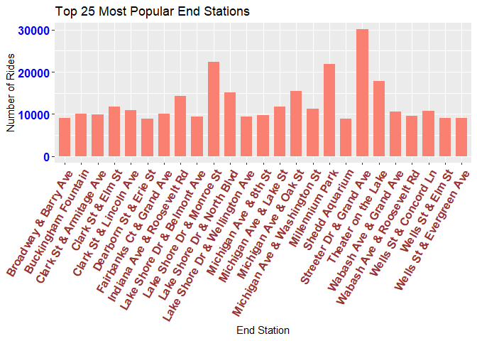<!-- -->

#### 5. SHARE

This phase includes findings of my analysis.

**Casual riders ride bikes between 10:00 A.M. and 8:00 P.M.**

    ## # A tibble: 48 x 3
    ##    member_casual  Hour number_of_ride
    ##    <chr>         <int>          <int>
    ##  1 casual            0          22661
    ##  2 casual            1          14130
    ##  3 casual            2           7515
    ##  4 casual            3           3944
    ##  5 casual            4           3240
    ##  6 casual            5           5132
    ##  7 casual            6          12588
    ##  8 casual            7          22638
    ##  9 casual            8          31224
    ## 10 casual            9          39722
    ## # ... with 38 more rows

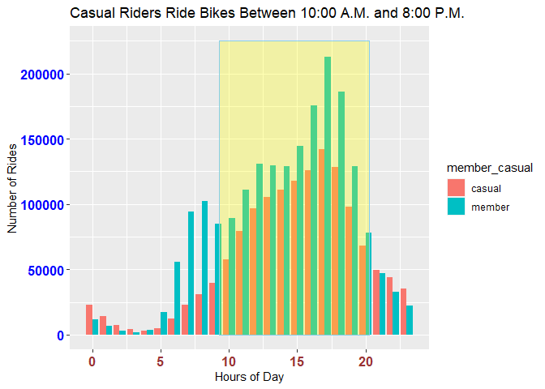<!-- -->

Casual riders ride bikes for longer durations than member riders.

    ## # A tibble: 14 x 3
    ##    member_casual wk_day mean_ride_len
    ##    <chr>         <ord>          <dbl>
    ##  1 casual        Mon             36.8
    ##  2 casual        Tue             34.6
    ##  3 casual        Wed             33.2
    ##  4 casual        Thu             33.4
    ##  5 casual        Fri             35.2
    ##  6 casual        Sat             39.7
    ##  7 casual        Sun             41.2
    ##  8 member        Mon             14.9
    ##  9 member        Tue             14.8
    ## 10 member        Wed             14.8
    ## 11 member        Thu             14.9
    ## 12 member        Fri             15.4
    ## 13 member        Sat             17.5
    ## 14 member        Sun             17.6

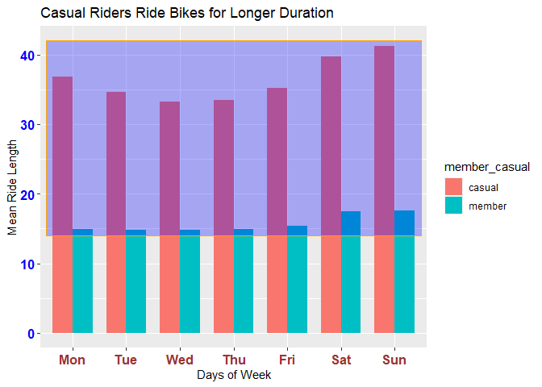<!-- -->

Casual riders ride bikes during weekends.

    ## # A tibble: 14 x 3
    ##    member_casual wk_day number_of_ride
    ##    <chr>         <ord>           <int>
    ##  1 casual        Mon            150434
    ##  2 casual        Tue            147734
    ##  3 casual        Wed            154084
    ##  4 casual        Thu            161342
    ##  5 casual        Fri            210025
    ##  6 casual        Sat            334816
    ##  7 casual        Sun            262061
    ##  8 member        Mon            261523
    ##  9 member        Tue            279842
    ## 10 member        Wed            296071
    ## 11 member        Thu            291443
    ## 12 member        Fri            305021
    ## 13 member        Sat            310782
    ## 14 member        Sun            254476

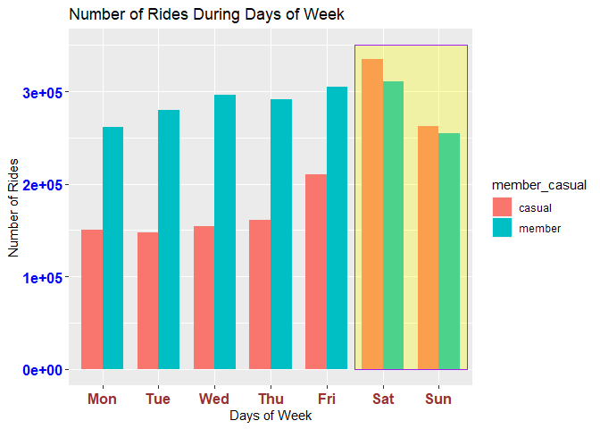<!-- -->

Casual riders ride bikes mainly during summer months of June to
September.

    ## # A tibble: 24 x 3
    ##    member_casual Month number_of_ride
    ##    <chr>         <ord>          <int>
    ##  1 casual        Jan            14474
    ##  2 casual        Feb             8442
    ##  3 casual        Mar            74506
    ##  4 casual        Apr           118515
    ##  5 casual        May            85488
    ##  6 casual        Jun           152100
    ##  7 casual        Jul           264400
    ##  8 casual        Aug           276240
    ##  9 casual        Sep           210735
    ## 10 casual        Oct           119867
    ## # ... with 14 more rows

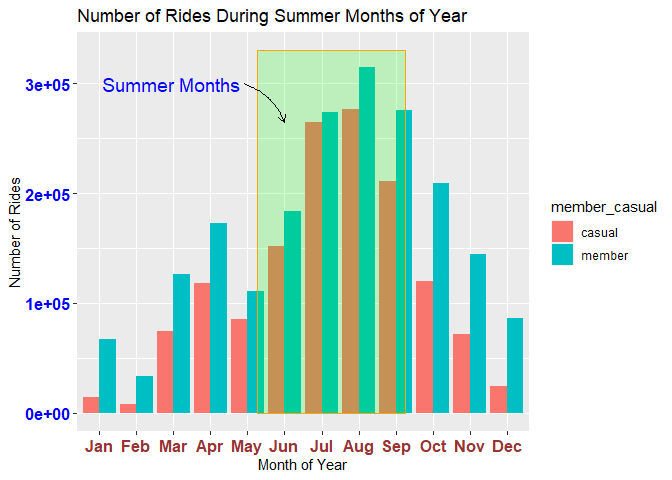<!-- -->

Casual riders ride bikes longer during summer months of May to August.

    ## # A tibble: 24 x 3
    ##    member_casual Month mean_ride_len
    ##    <chr>         <ord>         <dbl>
    ##  1 casual        Jan            22.6
    ##  2 casual        Feb            31.6
    ##  3 casual        Mar            32.6
    ##  4 casual        Apr            32.6
    ##  5 casual        May            44.8
    ##  6 casual        Jun            42.7
    ##  7 casual        Jul            44.9
    ##  8 casual        Aug            38.1
    ##  9 casual        Sep            32.9
    ## 10 casual        Oct            28.4
    ## # ... with 14 more rows

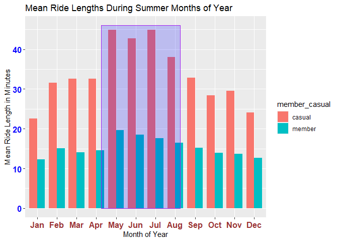<!-- -->

Casual riders ride mostly docked bikes.

    ## # A tibble: 6 x 3
    ##   rideable_type member_casual number_of_rides
    ##   <chr>         <chr>                   <int>
    ## 1 classic_bike  casual                 138642
    ## 2 classic_bike  member                 381387
    ## 3 docked_bike   casual                1095719
    ## 4 docked_bike   member                1335754
    ## 5 electric_bike casual                 186135
    ## 6 electric_bike member                 282017

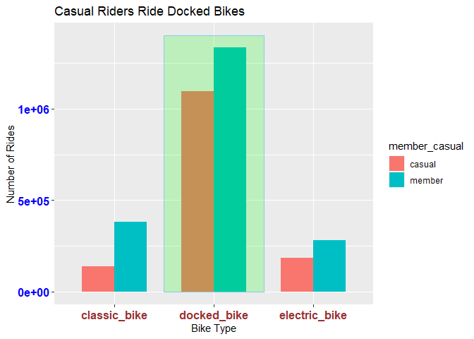<!-- -->

Casual riders ride docked bikes mostly in the weekends.

    ## # A tibble: 14 x 3
    ##    member_casual wk_day number_of_rides
    ##    <chr>         <ord>            <int>
    ##  1 casual        Mon             112760
    ##  2 casual        Tue             107478
    ##  3 casual        Wed             118027
    ##  4 casual        Thu             125206
    ##  5 casual        Fri             162037
    ##  6 casual        Sat             264597
    ##  7 casual        Sun             205614
    ##  8 member        Mon             168788
    ##  9 member        Tue             180666
    ## 10 member        Wed             198800
    ## 11 member        Thu             196745
    ## 12 member        Fri             202499
    ## 13 member        Sat             214682
    ## 14 member        Sun             173574

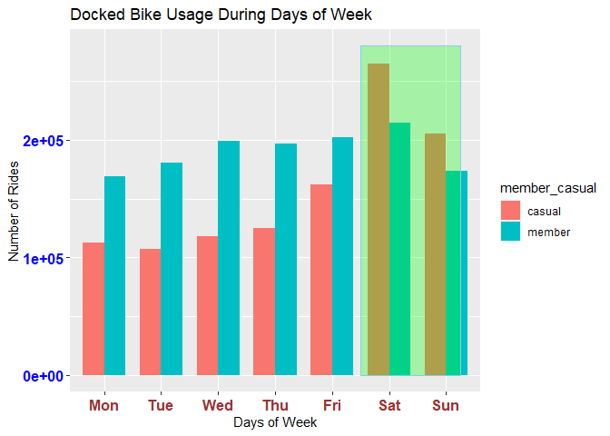<!-- -->

25 most popular start and 25 most popular end stations among the casual
riders

    ## # A tibble: 25 x 2
    ##    start_station_name           number_of_rides
    ##    <chr>                                  <int>
    ##  1 Streeter Dr & Grand Ave                27727
    ##  2 Lake Shore Dr & Monroe St              22911
    ##  3 Millennium Park                        20833
    ##  4 Theater on the Lake                    15811
    ##  5 Michigan Ave & Oak St                  14807
    ##  6 Indiana Ave & Roosevelt Rd             14161
    ##  7 Lake Shore Dr & North Blvd             14059
    ##  8 Michigan Ave & Lake St                 12313
    ##  9 Clark St & Elm St                      12259
    ## 10 Michigan Ave & Washington St           11274
    ## # ... with 15 more rows

    ## # A tibble: 25 x 2
    ##    end_station_name             number_of_rides
    ##    <chr>                                  <int>
    ##  1 Streeter Dr & Grand Ave                30125
    ##  2 Lake Shore Dr & Monroe St              22291
    ##  3 Millennium Park                        21877
    ##  4 Theater on the Lake                    17858
    ##  5 Michigan Ave & Oak St                  15521
    ##  6 Lake Shore Dr & North Blvd             15106
    ##  7 Indiana Ave & Roosevelt Rd             14323
    ##  8 Michigan Ave & Lake St                 11787
    ##  9 Clark St & Elm St                      11732
    ## 10 Michigan Ave & Washington St           11281
    ## # ... with 15 more rows

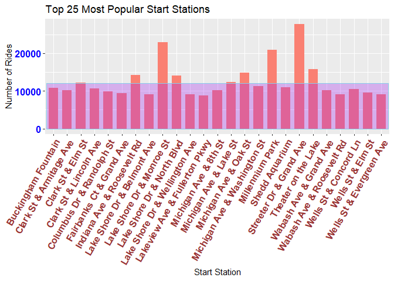<!-- -->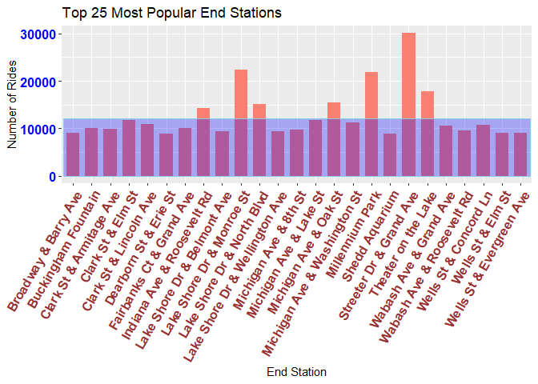<!-- -->

#### 6. ACT

This phase is the conclusion of my analysis where I am recommending the
following top three recommendations for the stakeholders.

1.  Offer membership discount to casual riders in the weekends.

2.  Run advertisement campaign focusing casual riders in the electronics
    and social media platforms between 10:00 A.M. and 8:00 P.M. from May
    to September. Offering trial membership during the summer would be a
    good option. Casual riders ride mostly in the summer which would
    give them enough experience of using the membership during this time
    frame. This could cause a change of mind to become member riders.

3.  Run banner and poster advertisements for discounted membership in
    and around the 25 most popular start and 25 most popular end
    stations among the casual riders.

Most of the riders are using docked bike so there is a huge potential in
classic and electric bike usage. This point should also be noted for the
marketing strategy.
